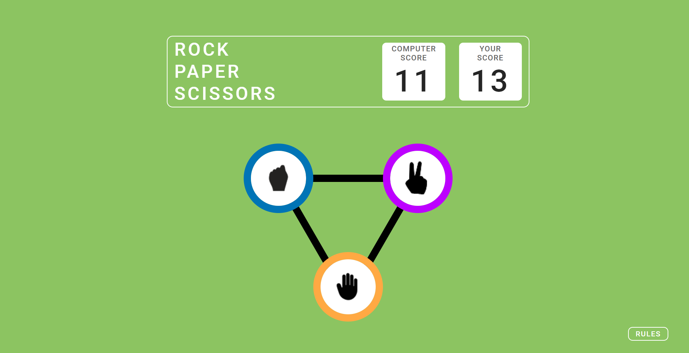
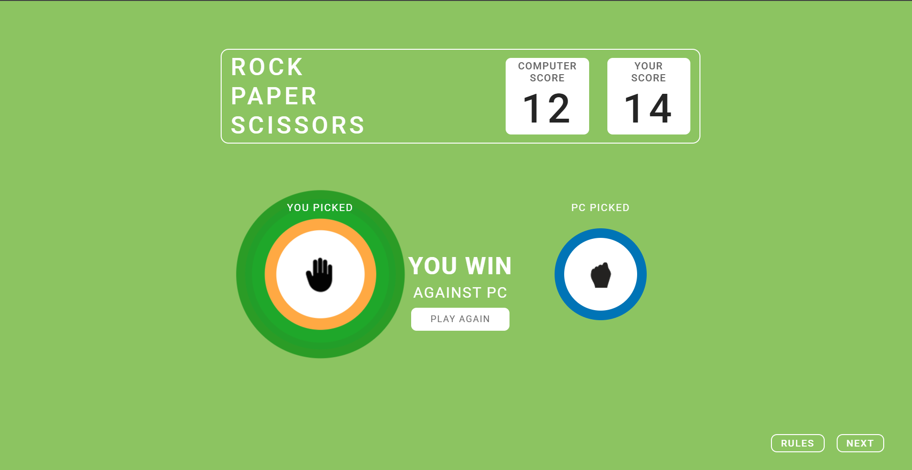
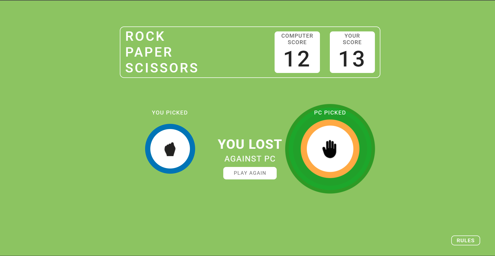
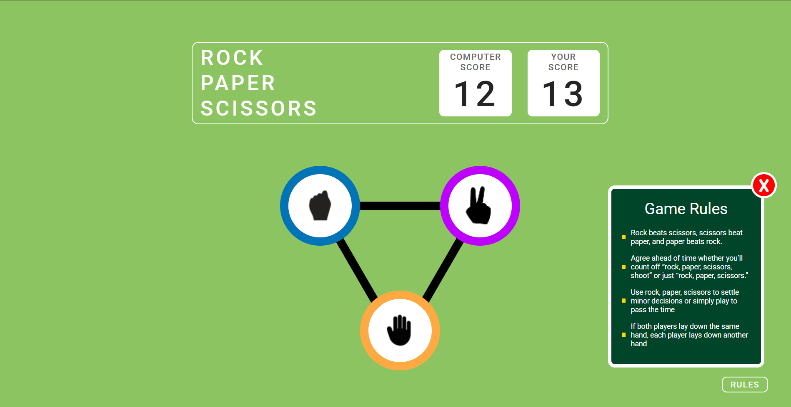
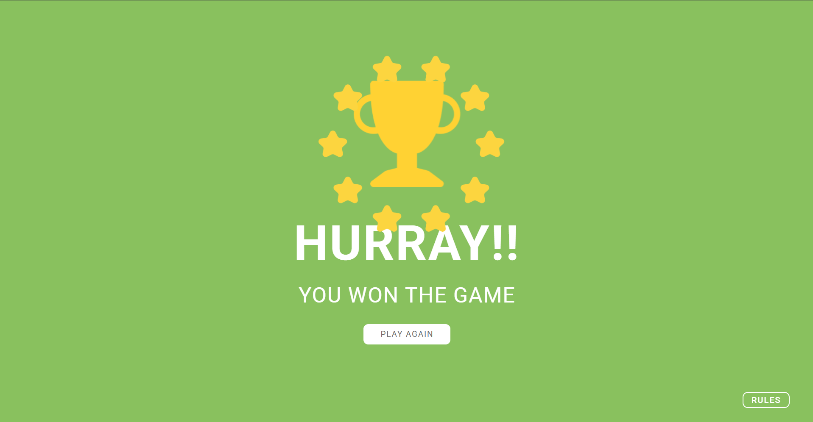

# Rock, Paper, Scissors game
    - Rock paper scissors is an intransitive hand game, usually played between two people, in which each player simultaneously forms one of three shapes with an outstretched hand. 
    - These shapes are "rock" (a closed fist), "paper" (a flat hand), and "scissors" (a fist with the index finger and middle finger extended, forming a V).
    - it has three possible outcomes: a draw, a win, or a loss. 
    - A player who decides to play rock will beat another player who chooses scissors but will lose to one who has played paper
    - A play of paper will lose to a play of scissors. 
    - If both players choose the same shape, the game is tied but is usually replayed until there is a winner.
    - Rock paper scissors is often used as a fair choosing method between two people, to settle a dispute or make an unbiased group decision. 

## Features:
    1.	The game is designed for two players, one is you as a player and the other opponent is your computer (YOUR PC).
    2.	There will simultaneous turns given to you and your computer, as soon as you choose one option for yourself ie. stone/paper/scissor your opponent (the PC) will also strike at the same time.
    3.	Show the respective scores on the screen for computer and human
    4.	Different messages are displayed on the screen as per the win of the participants.
    5.	There is a rules section at the bottom right, so as soon as you click on it, a pop up will open and there is a close button to close the pop up.
    6.	It stores the scores in the browser's local storage which make sure that the scores are not lost on reloading the page.
    7.	It also shows celebration animation if the human wins against the computer.

## FAQ 
    Do the scores reset after clicking play again on ANY PAGE?
    => NO
    Is the Hurray Page visible only after a certain score, or after every win by the user?
        => After EVERY win by the USER
    Is there any Maximum score for deciding a WIN?
        => NO, WIN or LOSE is decided on every game level, and the score keeps on incrementing for either the PC or the User.

NOTE: For your turn in the game, you will have to choose the option manually by clicking on one of the options, but for your computer it will be decided by the logic written in code.

